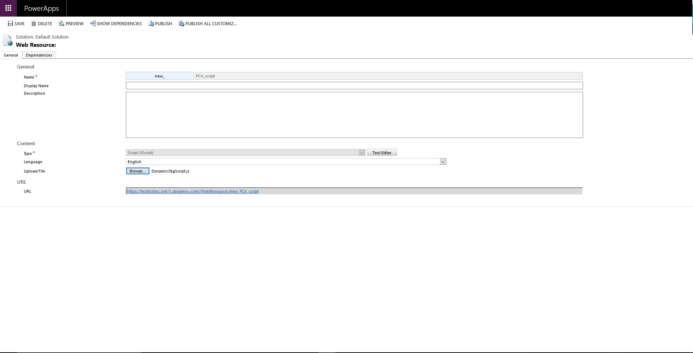

# Current steps to get started.

###Step 1

Dynamics 365 CRM>Settings>Customization>Customize the System

 
###Step 2

Components>Web Resources

 
Add the New web resource. Add Dynamics Tag script, save and publish.

 
###Step 3

Go back to Sales>Contacts
Create a new Contact form. Then click “Form” at the top, followed by “Form properties”.

 
In the form libraries select add and add the pca script.

 
After which in the event handlers click add and choose the pca library and in the function type in “startPCA”

 
Then in the parameters specify the account code and click OK
Make sure Control is “Form” and Event is “OnLoad” and confirm by clicking ok

###Step 4

In the form layout set up your forms to your specification and for each element confirm the id by double-clicking on it and going to “Details” tab and the “Name” will contain the field id you’ll need to use when it comes mapping the service key in your Loqate account dashboard.

 
IMPORTANT NOTE: Currently it is not possible for users to create a Tag based service key without going through the on-page setup, which does not work on Dynamics. To resolve this issue you need to get in touch with Loqate support team we will create a tag service key for you to map.

